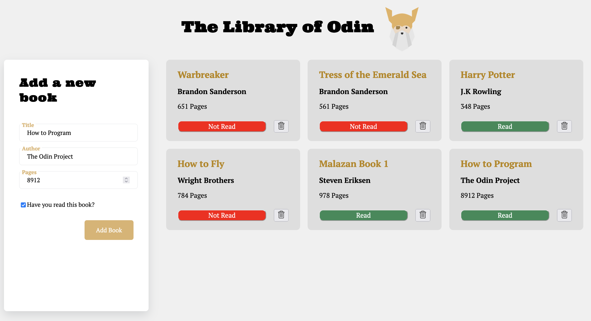

# Odin Library Project

My goal for this project was to design a dashboard to view library books in a simple UI, along with using JS to add, update, and delete books in the library.

Since the core lesson in TOP prior to this project was about objects and constructors, they were used in creating and storing the books. I also used prototype functions to update the "read" state of the books.

For this project I wanted to focus on DOM manipulation using JS, so all data is stored on localStorage.
